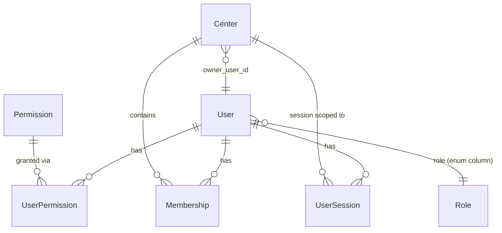

# Owlexa Backend — Authorization Mechanism Analysis Report

> **Generated:** 2026-07-15  
> **Scope:** `owlexa-backend/` + `owlexa-frontend/`  
> **Method:** Source-code-only analysis — no speculation, only what is actually implemented.

---

## 1. Overview of the Authorization Model

### 1.1 Model type

The system uses a **hybrid RBAC (Role-Based Access Control)** model with a partially implemented fine-grained permission system:

| Layer | Mechanism | Where |
|-------|-----------|-------|
| **Role-based URL guard** | Spring Security `HttpSecurity` pattern matching via `.hasAnyAuthority("ROLE")` | `SecurityConfig.java` |
| **Fine-grained permission DB** | `permissions` table + `user_permission` join table, many-to-many via `UserPermission` entity | DB schema + seed data |
| **Programmatic service check** | `AuthorizationService` (used in only 1 controller) | `modules/user/service/AuthorizationService.java` |
| **Tenant-level data isolation** | Hibernate `@Filter` + `TenantContext` (ThreadLocal) | Multiple entities + `TenantHibernateFilter` |

**In practice, the primary enforcement mechanism is role-based URL-pattern matching.** The fine-grained permission system (10 permission codes in the `permissions` table) is **seeded in the database** but is only checked programmatically in **one place**: `CenterController.create()`.

### 1.2 Distinction between Authentication and Authorization

**Yes, there is a clear distinction in the code:**

| Concern | Files |
|---------|-------|
| **Authentication** (who you are) | `JwtFilter.java`, `JwtUtil.java`, `AuthService.java`, `CustomUserDetailsService.java`, `AuthController.java` |
| **Authorization** (what you can do) | `SecurityConfig.java` (URL patterns), `AuthorizationService.java` (programmatic checks), `TenantHibernateFilter.java` (tenant isolation) |

- **Authentication** happens in `JwtFilter`: it validates the JWT, verifies the session is active, loads `UserDetails`, and sets `SecurityContextHolder`.
- **Authorization** happens at two levels: (a) `SecurityConfig.filterChain()` declares which URL prefixes require which role authority, and (b) `TenantHibernateFilter` enables Hibernate row-level filters for tenant isolation.

---

## 2. Authorization Data Structure

### 2.1 Core entities

| Entity | Table | Key fields | File |
|--------|-------|------------|------|
| `User` | `users` | `id`, `phoneNumber`, `password`, `role` (enum), `center_id` (for tenant filter) | `modules/user/entity/User.java` |
| `Role` | *(Java enum)* | `ADMIN`, `OWNER`, `TEACHER`, `STUDENT`, `CASHIER` | `modules/user/entity/Role.java` |
| `Permission` | `permissions` | `id`, `code` (unique), `description` | `modules/user/entity/Permission.java` |
| `UserPermission` | `user_permission` | `id`, `user_id` (FK), `permission_id` (FK), `granted_at` | `modules/user/entity/UserPermission.java` |
| `Membership` | `membership` | `id`, `user_id` (FK), `center_id` (FK), `joined_by_user_id` (FK) | `modules/user/entity/Membership.java` |
| `Center` | `centers` | `id`, `owner_user_id` (FK), `name`, `subdomain` (unique) | `modules/user/entity/Center.java` |
| `UserSession` | `user_sessions` | `id` (UUID), `user_id` (FK), `center_id` (FK), `refresh_token_hash`, `is_active`, etc. | `modules/user/entity/UserSession.java` |

### 2.2 Relationships



- **User → Permission:** Many-to-many via `user_permission` join table.  
  *Source: `User.java` line 43-45 (`userPermissions` field), `UserPermission.java` (`@ManyToOne` to both User and Permission).*

- **User → Center (membership):** Many-to-many via `membership` table.  
  *Source: `Membership.java` — composite unique constraint `(user_id, center_id)`, `@ManyToOne` to both.*

- **User → Role:** 1-to-1, stored as an `@Enumerated(EnumType.STRING)` column directly on `users` table.  
  *Source: `User.java` line 38-40.*

- **UserSession → Center:** Many-to-one, nullable. Set at login time from first membership.  
  *Source: `UserSession.java` line 52-54, `JwtFilter.java` lines 62-72.*

### 2.3 Permission definition style

Permissions are **hybrid**: the *codes* are defined as string values in seed data, but the *enforcement* of those permissions is not automated via annotations — it requires explicit `AuthorizationService.hasPermission()` calls.

- **Seed data defines 10 permission codes:**  
  `MANAGE_STUDENTS`, `MANAGE_TEACHERS`, `MANAGE_CLASSES`, `MANAGE_SCHEDULES`, `MANAGE_FEE_RECORDS`, `MANAGE_ESSAYS`, `MANAGE_MOCK_TESTS`, `VIEW_REPORTS`, `MARK_ATTENDANCE`, `ENROLL_STUDENTS`  
  *Source: `sql/seed_data_v4_english.sql` lines 148-158.*

- There is **no Java enum or constant class** mapping these permission codes. They are plain strings looked up from the DB.
- Permission-to-role mapping exists **only in seed data**, not in code. Role-based URL guards in `SecurityConfig` are the real enforcement.

---

## 3. Where and How Permission Checks Are Performed

### 3.1 Middleware / Filter / Guard layer

| Order | Filter | Responsibility | File |
|-------|--------|---------------|------|
| 1 (highest) | `DomainResolverFilter` | Resolves subdomain → center ID, sets `request` attribute | `common/filter/DomainResolverFilter.java` |
| 2 | `JwtFilter` | Validates JWT, loads user, sets `SecurityContext`, resolves tenant context | `common/security/JwtFilter.java` |
| 3 | `TenantHibernateFilter` | Enables Hibernate `tenantFilter` on current session | `common/filter/TenantHibernateFilter.java` |
| 4 | Spring Security filter chain | URL pattern authority matching from `SecurityConfig` | `common/security/SecurityConfig.java` |

### 3.2 Which layer performs permission checks

| Layer | Mechanism | Coverage |
|-------|-----------|----------|
| **API Gateway / Filter chain** | `SecurityConfig.authorizeHttpRequests()` URL-pattern matching `hasAnyAuthority("ROLE")` | **All endpoints** |
| **Controller** | `AuthorizationService.hasPermission()` / `hasRole()` — used **only** in `CenterController.create()` | **1 endpoint only** |
| **Service** | `SecurityContextHolder.getContext().getAuthentication().getName()` → look up user → check role/membership manually | **All service methods that need current user** |
| **Database (row-level)** | Hibernate `@Filter(name = "tenantFilter")` on 16 entities | **All tenant-aware entities** |

**Key observation:** There are **no `@PreAuthorize` or `@PostAuthorize` annotations** anywhere in the codebase. Spring method security is not enabled. The `SecurityConfig` class does not have `@EnableMethodSecurity`.

### 3.3 Frontend authorization

The frontend has a **UI-level role guard only** — it hides UI, but does not independently enforce security:

| Component | Mechanism | File |
|-----------|-----------|------|
| `ProtectedRoute` | Checks `isAuthenticated` + optional `allowedRoles` array; redirects to `/login` or `/unauthorized` | `src/router/ProtectedRoute.tsx` |
| `useAuthStore` | Zustand persisted store holding `accessToken`, `user.roleName`, `isAuthenticated` | `src/store/authStore.ts` |

The frontend role check is a **UX convenience only** — the backend is the authoritative gate. A malicious user could bypass the frontend guard by calling the API directly.

---

## 4. Process Flow of a Permissioned Request

### Concrete example: `POST /owner/centers` (create a new center)

```text
┌──────────────────────────────────────────────────────────────────────┐
│ Step 1: CLIENT sends POST /owner/centers                            │
│         Headers: Authorization: Bearer <access_token>                │
│                  Host: hcm.owlexa.vn                                 │
└────────────────────────────┬─────────────────────────────────────────┘
                             ▼
┌──────────────────────────────────────────────────────────────────────┐
│ Step 2: DomainResolverFilter (Ordered.HIGHEST_PRECEDENCE)            │
│         • Reads Host header "hcm.owlexa.vn"                          │
│         • Extracts subdomain "hcm"                                   │
│         • Queries CenterRepository.findBySubdomain("hcm")            │
│         • Sets request attributes:                                   │
│           resolvedCenterId = 1, resolvedCenter = Center(id=1)        │
│         File: common/filter/DomainResolverFilter.java                │
└────────────────────────────┬─────────────────────────────────────────┘
                             ▼
┌──────────────────────────────────────────────────────────────────────┐
│ Step 3: JwtFilter (runs after DomainResolverFilter)                  │
│         • Extracts "Bearer <token>" from Authorization header        │
│         • Checks tokenType != "refresh" (access token only)          │
│         • Extracts: subject=phoneNumber, sessionId from JWT claims   │
│         • Validates session: sessionRepository.findByIdAndActiveTrue │
│         • Loads UserDetails via CustomUserDetailsService              │
│           → creates User with authorities=[user.getRole().name()]    │
│           e.g., authorities=["OWNER"]                                │
│         • Sets SecurityContextHolder authentication                  │
│         • Resolves tenant: TenantContext.setCurrentTenantId(centerId)│
│         File: common/security/JwtFilter.java                         │
└────────────────────────────┬─────────────────────────────────────────┘
                             ▼
┌──────────────────────────────────────────────────────────────────────┐
│ Step 4: TenantHibernateFilter (runs after JwtFilter)                 │
│         • Reads TenantContext.getCurrentTenantId()                    │
│         • Enables Hibernate filter:                                  │
│           session.enableFilter("tenantFilter")                       │
│                    .setParameter("tenantId", tenantId)               │
│         • All subsequent JPA queries auto-filter by center_id        │
│         File: common/filter/TenantHibernateFilter.java               │
└────────────────────────────┬─────────────────────────────────────────┘
                             ▼
┌──────────────────────────────────────────────────────────────────────┐
│ Step 5: Spring Security URL-pattern matching                         │
│         • URL "/owner/centers" matches .requestMatchers("/owner/**") │
│         • Requires: .hasAnyAuthority("OWNER")                        │
│         • User's authorities = ["OWNER"] → MATCH → ALLOW             │
│         File: common/security/SecurityConfig.java lines 57-62       │
└────────────────────────────┬─────────────────────────────────────────┘
                             ▼
┌──────────────────────────────────────────────────────────────────────┐
│ Step 6: CenterController.create()                                    │
│         • Programmatic check:                                        │
│           authorizationService.hasPermission("CENTER_CREATE")        │
│           || authorizationService.hasRole(Role.OWNER)                │
│         • hasRole() → checks SecurityContext → get phoneNumber       │
│           → userRepository.findByPhoneNumber → compares role enum    │
│         • hasPermission() → checks user_permission join table        │
│         File: modules/class_management/controller/CenterController   │
│               .java lines 24-27                                      │
└────────────────────────────┬─────────────────────────────────────────┘
                             ▼
┌──────────────────────────────────────────────────────────────────────┐
│ Step 7: CenterService.create(request)                                │
│         • Resolves current user from SecurityContextHolder            │
│         • Creates Center entity with owner = current user            │
│         • TenantEntityListener.@PrePersist auto-sets center_id       │
│         File: modules/class_management/service/CenterService.java    │
│               common/listener/TenantEntityListener.java              │
└────────────────────────────┬─────────────────────────────────────────┘
                             ▼
┌──────────────────────────────────────────────────────────────────────┐
│ Step 8: TenantHibernateFilter.finally block                          │
│         • TenantContext.clear() — removes ThreadLocal tenantId       │
│         File: common/filter/TenantHibernateFilter.java line 38      │
└──────────────────────────────────────────────────────────────────────┘
```

---

## 5. Scope of Permissions

### 5.1 Row-level / data-level isolation (Tenant)

**Yes.** The system implements tenant-level data isolation via Hibernate filters:

- **16 entities** implement `TenantAware` interface:  
  `Attendance`, `Class`, `Schedule`, `StudentDocument`, `ClassEnrollment`, `EssayRubric`, `EssaySubmission`, `MockTest`, `MockTestAttempt`, `FeeRecord`, `Payment`, `TeacherCenterProfile`, `Center`, `Membership`, `User`, `UserSession`

- Each declares `@FilterDef(name = "tenantFilter")` and `@Filter(name = "tenantFilter", condition = "center_id = :tenantId")`.

- `TenantHibernateFilter` enables the filter with the current tenant ID from `TenantContext` before each request.

- `TenantEntityListener.@PrePersist` auto-sets the `center` field on new entities from `TenantContext`.

- `TenantEntityListener.@PreUpdate` **throws `SecurityException`** if an entity's `center_id` differs from the current tenant — preventing cross-tenant data modification.

*Source files: `common/filter/TenantHibernateFilter.java`, `common/listener/TenantEntityListener.java`, `common/context/TenantContext.java`*

### 5.2 User-level isolation within a tenant

**Undetermined / Needs clarification.** While the tenant filter isolates data by `center_id`, there is **no explicit row-level filter** preventing, for example, one student from viewing another student's data within the same center. Service methods rely on the `SecurityContextHolder` to get the current user and then query only "my" data:

- `findMyEssays()` in `EssayService` filters by the current student's ID
- `findMyClassesAsTeacher()` in `ClassService` filters by the current teacher's ID

This is **manual filtering in service code**, not a declarative security mechanism. There is no uniform pattern or base class enforcing this across all services.

### 5.3 Field-level / attribute-level security

**Not implemented.** There is no mechanism to hide or mask specific fields based on role. All API responses return full DTOs regardless of the caller's role.

### 5.4 Multi-tenant

**Yes.** The system is multi-tenant:
- Tenants = `Center` entities (e.g., "hcm", "hanoi")
- Subdomain-based routing via `DomainResolverFilter`
- Hibernate-level data isolation
- Session-scoped tenant context set during login in `JwtFilter`

**Note:** The `ADMIN` role (user #1 in seed data) has **no membership** in any center. This means when an ADMIN logs in, `resolveCenter()` returns `null`, and `TenantContext` is not set. The ADMIN effectively operates **outside** the tenant filter scope — which could be intentional (super-admin sees all data) but is not explicitly documented in code.

---

## 6. List of Existing Roles and Permissions

### 6.1 Roles (from `Role.java` enum)

| Role | Registration | Created by | URL prefix guard |
|------|-------------|------------|-----------------|
| `ADMIN` | No public API | Manual SQL seed | `/admin/**` |
| `OWNER` | Self-register (`/auth/register/owner`) | Self | `/owner/**` |
| `TEACHER` | Cannot self-register | OWNER via `TeacherController` | `/teacher/**` |
| `STUDENT` | Self-register (`/auth/register/student`) | Self or OWNER bulk | `/student/**` |
| `CASHIER` | Cannot self-register | OWNER via `CashierController` | `/cashier/**` |

### 6.2 Permissions (from `sql/seed_data_v4_english.sql`)

| Permission Code | Description | Assigned to (seed data) |
|----------------|-------------|------------------------|
| `MANAGE_STUDENTS` | Create, update, delete students | OWNER |
| `MANAGE_TEACHERS` | Create, update, delete teachers | OWNER |
| `MANAGE_CLASSES` | Create, update, delete classes | OWNER |
| `MANAGE_SCHEDULES` | Manage class schedules | OWNER |
| `MANAGE_FEE_RECORDS` | Manage fee records and payments | OWNER, CASHIER |
| `MANAGE_ESSAYS` | Manage essay rubrics and grading | OWNER |
| `MANAGE_MOCK_TESTS` | Manage mock tests and results | OWNER |
| `VIEW_REPORTS` | View analytics and reports | OWNER, TEACHER, CASHIER |
| `MARK_ATTENDANCE` | Mark student attendance | OWNER, TEACHER |
| `ENROLL_STUDENTS` | Enroll and drop students from classes | OWNER |

**Important:** These permissions are stored in the DB and assigned in seed data, but the only place they are **checked in application code** is `CenterController.create()` which checks for `CENTER_CREATE` (which is **not even in the seed data list above** — it's an ad-hoc code used only in that one controller). The URL-pattern guards in `SecurityConfig` are the actual enforcement layer.

### 6.3 Special roles

- **`ADMIN`**: Has its own URL prefix `/admin/**` guarded by `.hasAnyAuthority("ADMIN")`. The ADMIN user (phone `0000000001`) has **no membership** in any center, no explicit permissions in `user_permission` table, and operates without a tenant context. This means ADMIN bypasses the Hibernate tenant filter — effectively a super-admin with unrestricted data access.

- **No explicit "service-to-service" or "system account" role exists** in the codebase.

---

## 7. Coding Conventions When Adding New Permissions

### 7.1 Current pattern (based on existing code)

When adding a new API/function that requires authorization, the current codebase follows these conventions:

1. **URL prefix routing:** Place the endpoint under the appropriate role prefix (`/owner/`, `/teacher/`, `/student/`, `/cashier/`, `/admin/`). The `SecurityConfig` will automatically guard it.  
   *Example: `StudentController` uses `@RequestMapping("/owner/students")`*

2. **Service-layer user resolution:** In the service method, get the current user via:
   ```java
   String phone = SecurityContextHolder.getContext().getAuthentication().getName();
   User user = userRepository.findByPhoneNumber(phone).orElseThrow(...);
   ```
   *This pattern is repeated across 8+ service files with no helper base class.*

3. **For cross-role endpoints:** Some endpoints support multiple roles by declaring multiple `@RequestMapping` paths:
   ```java
   @PostMapping({
       "/owner/fee-record/{feeRecordId}/payments/cash",
       "/cashier/fee-record/{feeRecordId}/payments/cash"
   })
   ```
   *Source: `PaymentController.java` lines 18-21.*

4. **Tenant-awareness:** If the entity should be scoped to a center, implement `TenantAware` and add `@FilterDef` + `@Filter` + `@EntityListeners(TenantEntityListener.class)`.

### 7.2 What is NOT standardized

- There is **no abstract base service** for resolving the current user.
- There is **no `@PreAuthorize` annotation convention**.
- The `AuthorizationService` exists but is used in only **1 controller**.
- Fine-grained permissions from `user_permission` table are **not systematically checked**.
- There is **no documentation in code** about what permissions are required for which endpoint.

### 7.3 Implicit convention

The *de facto* convention is **URL-prefix-based role gating** — if an endpoint is under `/owner/**`, only OWNER role can access it. The fine-grained permission system is effectively unused in practice except for the one `CENTER_CREATE` check.

---

## 8. Risks, Uncertainties, and Technical Debt

### 8.1 Inconsistent permission checks

| Issue | Detail |
|-------|--------|
| **AttendanceController unprotected by role** | Mapped to `/attendance`, which matches `.anyRequest().authenticated()` — any authenticated user (STUDENT, CASHIER, etc.) can mark attendance. File: `AttendanceController.java` line 14. |
| **Essay endpoints open to all authenticated users** | `/essays/submit`, `/essays/{id}`, `/essays/{id}/grading-result`, `/essays/{id}/manual-feedback` have no role prefix. Any authenticated user can access. File: `EssayController.java`. |
| **Fee records open to all authenticated users** | `/fee-records/me` has no role prefix guard. File: `FeeRecordController.java`. |
| **Mock test endpoints partially guarded** | Owner CRUD endpoints (`/owner/mock-tests/*`) are guarded, but student-facing endpoints like `/mock-tests/{testId}/start` need verification — they fall under `.anyRequest().authenticated()`. |

### 8.2 AuthorizationService under-utilization

The `AuthorizationService` provides `hasRole()`, `hasPermission()`, and `isOwnerOfCenter()` — a well-designed abstraction — but it is used in **only one place** (`CenterController.create()`). 8+ other service classes manually resolve the current user from `SecurityContextHolder` with duplicated code.

### 8.3 Hardcoded patterns

- Every service manually does `SecurityContextHolder.getContext().getAuthentication().getName()` — no shared helper.
- Permission codes like `"CENTER_CREATE"` (in `CenterController`) are **string literals** with no constant/enum definition.
- The permission codes in seed data vs. the `CENTER_CREATE` code in code don't match — `CENTER_CREATE` doesn't exist in the seed data.

### 8.4 Seed data vs. code mismatch

| Permission Code | In Seed Data? | Used In Code? |
|----------------|:---:|:---:|
| `MANAGE_STUDENTS` | ✅ | ❌ |
| `MANAGE_TEACHERS` | ✅ | ❌ |
| `MANAGE_CLASSES` | ✅ | ❌ |
| `MANAGE_SCHEDULES` | ✅ | ❌ |
| `MANAGE_FEE_RECORDS` | ✅ | ❌ |
| `MANAGE_ESSAYS` | ✅ | ❌ |
| `MANAGE_MOCK_TESTS` | ✅ | ❌ |
| `VIEW_REPORTS` | ✅ | ❌ |
| `MARK_ATTENDANCE` | ✅ | ❌ |
| `ENROLL_STUDENTS` | ✅ | ❌ |
| `CENTER_CREATE` | ❌ | ✅ (CenterController.java:26) |

This reveals that the fine-grained permission table is essentially **dead code** — it's populated but never read by any authorization logic (except the one `CENTER_CREATE` check which references a code not in the seed data).

### 8.5 Missing method-level security

Spring Security's `@EnableMethodSecurity` is **not enabled**. This means `@PreAuthorize`, `@PostAuthorize`, `@PreFilter`, `@PostFilter` are not available. All authorization is done imperatively.

### 8.6 ADMIN role isolation concern

The ADMIN (user #1) has no `membership` record and no tenant context. This means:
- ADMIN cannot be scoped to any tenant filter
- If ADMIN calls tenant-filtered endpoints, the behavior is **undetermined** (filter not enabled = sees all data, or filter enabled with null parameter = undefined)

### 8.7 `@FilterDef` duplication

Every `TenantAware` entity duplicates the identical `@FilterDef(name = "tenantFilter", ...)` annotation. This could be centralized but isn't — risk of inconsistent filter naming across entities.

### 8.8 No audit trail for authorization decisions

There is no logging of authorization denials beyond Spring Security's default behavior. `GlobalExceptionHandler` catches `AccessDeniedException` with a simple `log.warn()` — no structured audit event.

---

## Summary

The Owlexa system uses a **hybrid RBAC model** with two layers: **(1) URL-prefix-based role gating** in Spring Security's `SecurityConfig` (the primary and de facto enforcement), and **(2) a partially implemented fine-grained permission system** stored in the `permissions`/`user_permission` tables that is seeded with 10 permission codes but is only checked programmatically in one controller (`CenterController`).

**Strengths:**
- Clean separation between authentication (JWT + session management) and authorization (Spring Security + tenant filters).
- Multi-tenant data isolation via Hibernate `@Filter` + `TenantEntityListener` is well-implemented with both `@PrePersist` (auto-set) and `@PreUpdate` (cross-tenant prevention) guards.
- Session management is robust — token rotation, reuse detection, device dedup, sliding + absolute expiration, concurrent device limits.
- The `AuthorizationService` abstraction is well-designed and ready for broader use.

**Points requiring attention for future changes:**
- The fine-grained permission table is populated but unused — either remove it or integrate it fully (e.g., via `@PreAuthorize("hasPermission(...)")` with a custom `PermissionEvaluator`).
- Several endpoints (`/attendance`, `/essays/*`, `/fee-records/me`) lack role-prefix guards and are open to any authenticated user — verify whether this is intentional.
- There is no standardized helper for resolving the current user; 8+ services duplicate the `SecurityContextHolder` lookup pattern.
- The `ADMIN` role's lack of tenant context should be explicitly documented as either "by design (super-admin)" or "needs fixing."
- Consider enabling `@EnableMethodSecurity` and migrating URL-pattern guards to annotation-based checks for finer granularity and self-documenting code.

